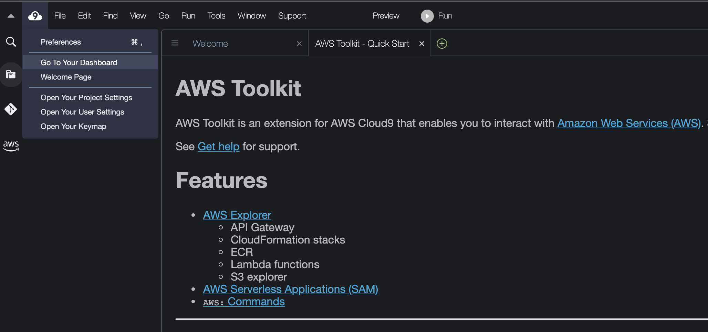
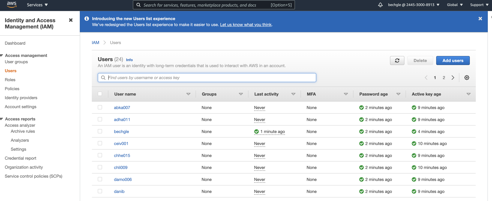
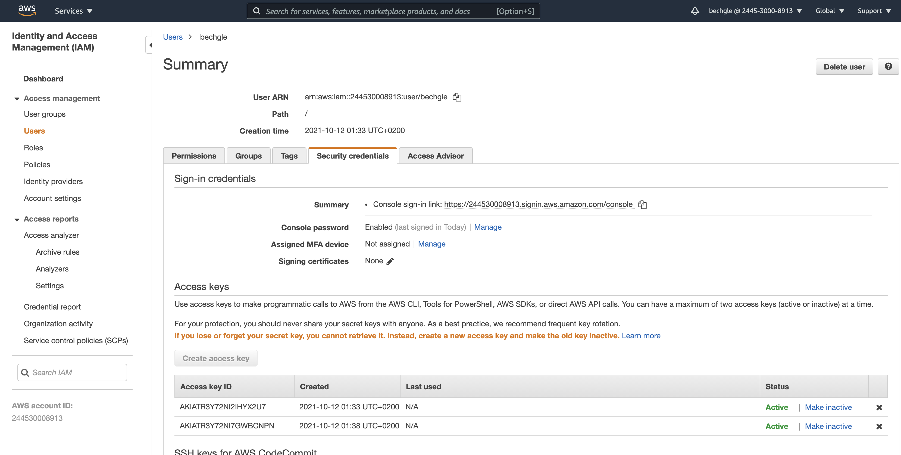
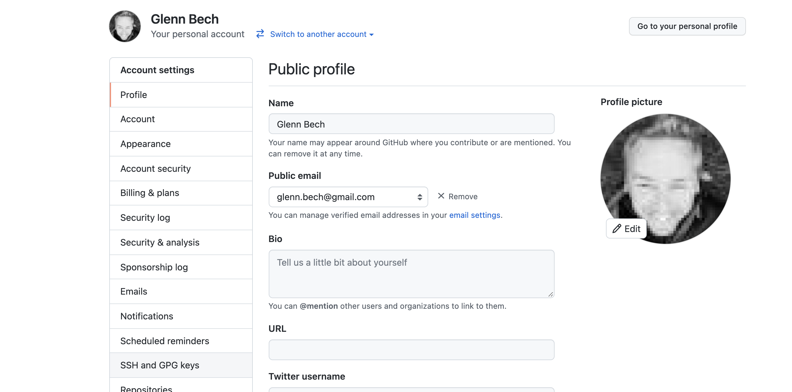
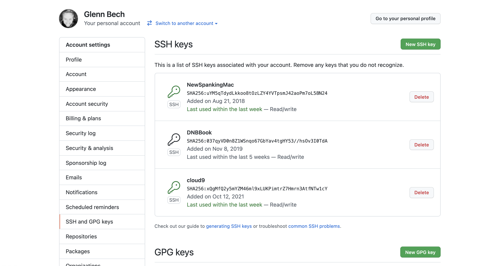
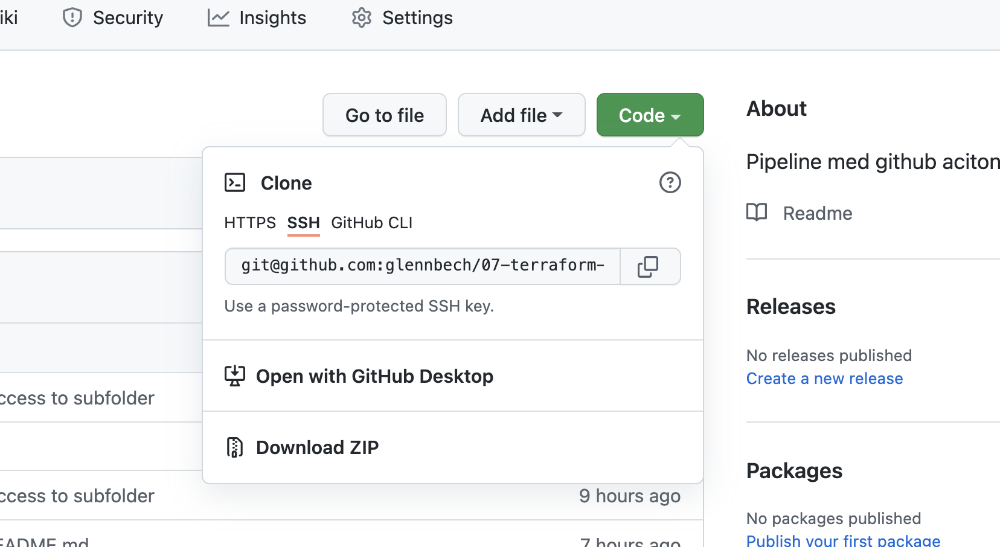

# Webapp og infrastruktur med React, Terraform og Open Source moduler

I denne øvingen skal du øve på 

* Mer avansert Github actions. For eksempel; Flere jobber og avhengigheter mellom jobber
* Mer avansert Github actions - Bruke funksjonen ```github.issues.createComment``` for å legge på kommentarer på Pull requests 
* Terraform i Pipeline - Terraform skal nå kjøres av GitHub actions
* Hvordan vi kan bruke GitHub Actions til å bygge & publisere en enkel React.js webapp
* AWS - Hvordan bruke en open source modul til å spare masse tid, og publisere en enkel React.js webapp

## Sjekk tillgang til Cloud 9 miøjøet ditt.

* I klasserommet får du tilgang til et Cloud9 miljø. Sørg for at du har tilgang til dette 
* Før du starter må du kage dine egne AWS Aksessnøkler for din IAM bruker 

* Gå til AWS fra Cloud 9



* Gå til tjenesten IAM og finn din *egen bruker*



* Lag nye nøkler (Create access Key)



Noter Access Key ID og Secret Access Key. Disse skal legges inn som Repo secrets i et senere steg!

## Autentiser Cloud9 mot GitHub 

Istedet for å oppgi brukernavn og passord hver gang man skal pushe kode til bitbucket, er det bedre å klone med  
ssh, og bruke nøkler for å autentisering

For å sette dette opp på Cloud9 må man kjøre følgende kommandoer 

```shell
ssh-keygen -t rsa -C "your@email.com" 
```
Aksepter alle default valg (trykk enter for alle svar-alternativer
```shell
cat ~/.ssh/id_rsa.pub
```

Filen kan for eksempel se slik ut ; 

```shell
ssh-rsa AAAAB3NzaC1yc2EAAAADAQABAAABAQC8iEq3aeSASyClMtpbjG4EUoCfmNeUr/QdJaNW7JU3FYvXs4VStclBkhx2OE1+U1yCA1+VzGAotsEhtELoahH7X41i5lyoHwM4uhsi1A940Pv537ty+9ljAlKBHPQ2wZrq/Oj7Ql5a5SFtu3j7KRrPxtn3CdzUFOTrJDGtZcMFrtAXgORoasyEZ4oacFjEyd8T9bb8zPs5gO2tNyhW1s8lNc3JvE+l6+psRMe2HVruMf6e4F1n+3dYPGicnernyBLrhEWU0wV2QM5uLWnweOy4OKs89ruGbIHEn8KYkKe/8xTqTWZLZjPw4hv5I6DS3NfyZXsW7/QkLKtd/7SL4Emd your@email.com
```
Kopier verdien. "Settings" for din bruker  

### Under "ssh & gpg keys" velg "new SSH key")



### lagre den for eksempel under navnet "cloud 9"



Konfigurerer Git 

```shell
git config --global user.name "Your Name"
git config --global user.email you@example.com
```
Du skal nå kunne klone, og pushe commits fra ditt cloud9 miljø

## Legg til Github repository secrets

* Lag en fork av dette repoet.
* Sjekk ut din fork i Cloud9 miljøet ditt med "git clone ...." *NB* Bruk SSH URL når du sjekker ut



* Legg til "repository secrets", verdier gis i klasserommet. Dette gjorde vi i øving 5. Hvis du trenger repetisjon, sjekk her; <https://github.com/PGR301-2021/05-cd-apprunner-with-docker#gi-github-actions-tilgang-til-n%C3%B8kler>

## Oppgave 1 - Fjern hard-kodinger i filene

I provider.tf har vi en Backend for Terraform sin state basert på S3. Du må her erstatte "glenn" med ditt eget studentnavn

```hcl
  backend "s3" {
    bucket = "pgr301-2021-terraform-state"
    key    = "glennbech/terraform-in-pipeline.state"
    region = "eu-north-1"
  }
```

Lag en variables.tf i rotkatalogen, og fjern hardkodingen av "glenn" i static_website.tf filen. Det er ikke god praksis å hardkode
verdier ("glenn") på denne måten. - https://www.terraform.io/docs/language/values/variables.html

Legg også spesielt merke til hvordan vi referer til modulernår de finnes i Terraform registry (https://registry.terraform.io/)

```hcl
module "static-site" {
    source  = "telia-oss/static-site/aws"
    version = "3.1.0"
    
    hosted_zone_name = "thecloudcollege.com"
    name_prefix      = "glenn"
    site_name        = "glenn.thecloudcollege.com"
    bucket_name      = "glenn.thecloudcollege.com"
}
```

## Oppgave 2 

Modifiser filen ```.github/workflows/pipeline.yaml``` og tilpass denne ditt eget miljø. Du må endre på bucket navn. Filene som lages av ```npm run build``` prosessen må kopieres til AWS.

Du må endre på denne delen og erstatte bucket ```bechgle.thecloudcollege.com``` med ditt eget bucket navn som du satt i static_website.tf

```yaml
- run: aws s3 cp build s3://bechgle.thecloudcollege.com --recursive --region eu-north-1
  working-directory: ./demo-app 
```

### Gjennomgang av Pipeline.yaml

Vi sette miljøvariabler på denne måten slik at terraform har tilgang til AWS nøkler, og har de rettighetene som er nødvendig. 

```yaml
    env:
      AWS_ACCESS_KEY_ID: ${{ secrets.AWS_ACCESS_KEY_ID }}
      AWS_SECRET_ACCESS_KEY: ${{ secrets.AWS_SECRET_ACCESS_KEY }}
      AWS_REGION: eu-north-1
```

Her ser vi et steg i en pipeline med en "if" - som bare skjer dersom det er en pull request som bygges, vi ser også at 
pipeline får lov til å fortsette dersom dette steget feiler. 

```
      - name: Terraform Plan
        id: plan
        if: github.event_name == 'pull_request'
        run: terraform plan -no-color
        continue-on-error: true
```

Her setter vi en miljøvariable lik teksten som et tidligere steg skrev til stdout når det kjørte 

```yaml
       env:
          PLAN: "terraform\n${{ steps.plan.outputs.stdout }}"
```

Her brukers den innebyggede funksjonen  ```github.issues.createComment``` til å lage en kommentar til en Pull request, med innholdet av Terraform plan. Altså, hva kommer til å skje hvis vi kjører en apply på denne.

```yaml
  script: |
    const output = `#### Terraform Format and Style 🖌\`${{ steps.fmt.outcome }}\`
    #### Terraform Initialization ⚙️\`${{ steps.init.outcome }}\`
    #### Terraform Validation 🤖\`${{ steps.validate.outcome }}\`
    #### Terraform Plan 📖\`${{ steps.plan.outcome }}\`
    <details><summary>Show Plan</summary>
    \n
    \`\`\`\n
    ${process.env.PLAN}
    \`\`\`
    </details>
    *Pusher: @${{ github.actor }}, Action: \`${{ github.event_name }}\`*`;
    github.issues.createComment({
      issue_number: context.issue.number,
      owner: context.repo.owner,
      repo: context.repo.repo,
      body: output
    })
```

En fin måte å sjekke om bygget kjører som respons på en push til main, bare kjør apply (endre infrastrukturen)
på endring i main branch 

```yaml
      - name: Terraform Apply
        if: github.ref == 'refs/heads/main' && github.event_name == 'push'
        run: terraform apply -auto-approves
```

Student webapp trenger infrastrukturen laget av terraform. Vi kan da bruke "needs" for å lage en avhengighet mellom en eller flere jobber; 

```yaml
student_webapp:
    env:
      AWS_ACCESS_KEY_ID: ${{ secrets.AWS_ACCESS_KEY_ID }}
      AWS_SECRET_ACCESS_KEY: ${{ secrets.AWS_SECRET_ACCESS_KEY }}
      AWS_REGION: eu-north-1
    needs: terraform
```

Å publisere en statisk website, og hoste denne på AWS S3 gjøres i to steg; 

* npm build, som bygger et sett med statiske websider av applikasjonen 
* kopiering av disse filene til en S3 bucket 

For en grundig gjennomgang av hva som skjer i kulissene her; sjekk gjerne ut denne; https://medium.com/@p_stotz/static-website-hosting-leverage-aws-s3-with-cloudfront-route53-acm-and-lambda-edge-8c781bc3b390
Fordelen med Terraformmoduler er at vi kan komme raskt i gang uten nødvemdigvis å kunne alle detaljene. 

# Test løsningen i nettleser

* Gratulerer! Du har nå publisert din egent React.js web app på AWS. I nettleser kan du nå skrive https.//<studentnavn>.thecloudcollege.com 
* Prøv å endre på Javascript filene, følg med på pipeline i "actions" i GitHub, og se at endringene kommer ut. 

# Ekstra 

Følg tutorial for hvordan dere kan lage egne terraform moduler; https://learn.hashicorp.com/tutorials/terraform/module-create
